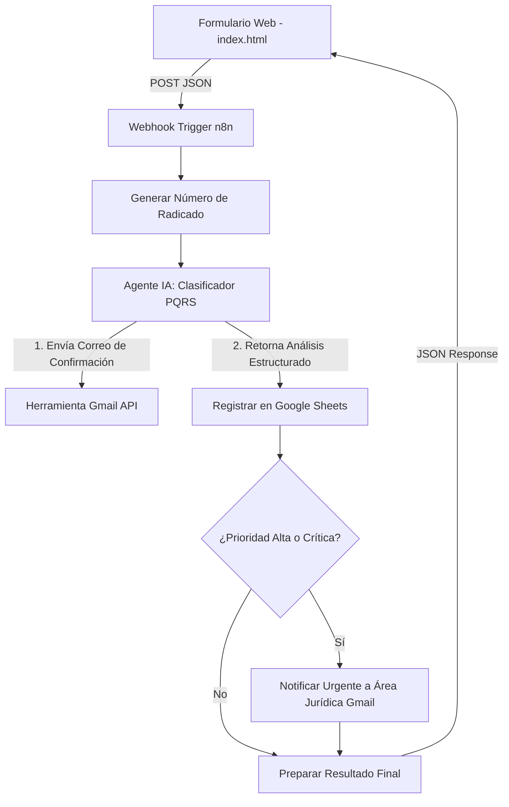

# Sistema Inteligente de Gestión de PQRSF

Este proyecto consiste en un **Sistema Inteligente de Peticiones, Quejas, Reclamos, Sugerencias y Felicitaciones (PQRSF)**, compuesto por un formulario web interactivo en el front-end y un potente flujo de automatización e inteligencia artificial en el back-end mediante **n8n**.

El sistema no solo registra las solicitudes, sino que utiliza modelos de lenguaje (LLM) para clasificarlas automáticamente por área y nivel de prioridad, detectando términos de riesgo y enviando notificaciones y correos de confirmación en tiempo real.

---

## 🛠️ Arquitectura del Sistema

El flujo completo del sistema se divide en dos componentes principales:



---

## 💻 Componentes

### 1. Front-end: Formulario de Registro (`index.html`)
Diseño de interfaz moderno y responsivo para la captura de datos de la solicitud.
- **Estética Premium (Glassmorphism)**: Interfaz fluida y limpia con soporte nativo para **Tema Claro/Oscuro**.
- **Panel de Configuración**: Permite cambiar la dirección del Webhook de n8n de forma manual.
- **Selector de Modo**:
  - **Modo Prueba (Test)**: Apunta a la URL de prueba de n8n (`/webhook-test/...`) para depuración directa desde el editor de flujos.
  - **Modo Producción (Prod)**: Apunta a la URL definitiva de n8n (`/webhook/...`).
- **Recibo Interactivo (Dynamic Receipt)**: Al enviarse con éxito, recibe la respuesta estructurada de n8n y muestra un ticket con el radicado generado, la categoría detectada por la IA, el área asignada y un mensaje de tiempo de respuesta dinámico según la prioridad.

### 2. Back-end: Flujo de Automatización (`PQRSF.json` — Nivel 1)
Definición de flujo importable para n8n que automatiza el procesamiento lógico de la solicitud.
- **Generación de Radicado**: Código JavaScript en n8n que calcula de manera única un código en formato `PQRS-YYYYMMDD-timestamp-random` y la fecha de recepción.
- **Clasificador IA (LangChain Agent + OpenAI GPT-4o-mini)**: 
  - Clasifica el tipo de solicitud (Petición, Queja, Reclamo, Sugerencia).
  - Identifica el área responsable (**Servicio al Cliente, Servicios Financieros, Operaciones, Jurídica o Innovación**).
  - Asigna prioridad (**Alta, Media o Baja**).
  - **Detección de Palabras Clave Críticas**: Si detecta términos sensibles como *fraude, estafa, robo, demanda, lavado de activos*, fuerza automáticamente la prioridad a **Alta** y asigna el área **Jurídica**.
  - Genera un resumen del caso de máximo 100 palabras.
- **Notificación por Gmail al Solicitante**: Envía un correo con diseño HTML responsivo confirmando la recepción y detallando el radicado, área asignada y plazo estimado de respuesta.
- **Base de Datos (Google Sheets)**: Registra en orden cronológico todos los metadatos de la solicitud procesada.
- **Notificación de Alerta Urgente**: Si el caso es clasificado con **Prioridad Alta**, envía una notificación por correo inmediata al área jurídica correspondiente con un resumen estructurado del caso.

### 3. Back-end: Pipeline en Python (`PQRSF_LangChain_Nivel2.ipynb` — Nivel 2)
Reimplementación completa del backend en Python, diseñada para ejecutarse como un Notebook de Jupyter o Google Colab.
- **LangChain ≥ 0.2 & LangGraph**: Utiliza el framework de agentes LangChain y la biblioteca LangGraph (`create_react_agent`) para implementar un agente inteligente bajo el patrón ReAct (Reason + Act).
- **Modelo LLM**: Emplea **Google Gemini (`gemini-2.5-flash`)** con temperatura `0` para obtener respuestas precisas y deterministas.
- **Estructuración con Pydantic**: Define un esquema estricto (`ClasificacionPQRS`) para asegurar que la salida de la IA cumpla con la estructura JSON requerida.
- **Integraciones Nativas**:
  - **Google Sheets API** (`gspread`): Permite registrar las PQRSF procesadas en la hoja de cálculo.
  - **Gmail API** (`googleapiclient`): Envía los correos de confirmación al usuario y alertas al área jurídica (incluye un modo demostrativo que imprime el correo en consola si no se configuran las credenciales).

---

## 🚀 Tecnologías Utilizadas

- **Front-end**: HTML5, CSS3 (Variables de diseño y transiciones CSS) y JavaScript Vanilla.
- **Orquestador (Nivel 1)**: [n8n](https://n8n.io/) (Flujos de trabajo basados en nodos).
- **Framework de Agentes (Nivel 2)**: [LangChain](https://js.langchain.com/) y [LangGraph](https://github.com/langchain-ai/langgraph) (Python).
- **Modelos de Inteligencia Artificial**:
  - OpenAI GPT-4o-mini (Nivel 1)
  - Google Gemini 2.5 Flash (Nivel 2)
- **Integraciones**:
  - Google Sheets API (Persistencia de datos en hoja de cálculo).
  - Gmail API (Envío de correos automáticos).

---

## ⚙️ Instrucciones de Configuración y Despliegue

### Requisitos Previos
- Tener instalado **Node.js** (versión 18 o superior) para correr el front-end localmente.
- Una instancia de **n8n** activa (para Nivel 1).
- Un entorno de Python con soporte para Jupyter o Google Colab (para Nivel 2).
- Claves de API de **OpenAI** y **Google Gemini**.
- Archivo de credenciales en formato JSON (`service_account.json`) de Google Cloud habilitado para las APIs de Sheets y Gmail.

### Paso 1: Configurar el Backend (Nivel 1 — n8n)
1. Abre tu instancia de n8n e importa el archivo [PQRSF.json](file:///c:/Users/chami/Desktop/ProyectoSistemasInteligentes/PQRSF.json).
2. Configura las credenciales de OpenAI, Gmail y Google Sheets en sus nodos respectivos.
3. Copia la URL del Webhook y activa el flujo.

### Paso 2: Configurar el Backend (Nivel 2 — Python & LangChain)
1. Sube el archivo [PQRSF_LangChain_Nivel2.ipynb](file:///c:/Users/chami/Desktop/ProyectoSistemasInteligentes/PQRSF_LangChain_Nivel2.ipynb) a Google Colab o ejecútalo localmente en Jupyter.
2. Agrega tu clave de API de Gemini en la configuración del entorno o la celda de credenciales.
3. Sube tu archivo JSON de credenciales de Google cuando la celda lo solicite.
4. Modifica las constantes del ID de la hoja de cálculo y corre todas las celdas del notebook para verificar el pipeline y ver el ciclo ReAct en consola.

### Paso 3: Ejecutar el Front-end
1. Levanta un servidor web local en la carpeta del proyecto:
   ```bash
   npx http-server -p 8080
   ```
2. Abre tu navegador en [http://localhost:8080](http://localhost:8080).
3. Configura la URL del webhook en el formulario según el modo que desees probar.

---

## 📽️ Videos Demostrativos

Los videos demostrativos del funcionamiento de ambos niveles se encuentran en el directorio `videos/`:
- **Nivel 1 (n8n)**: Demostración de las pruebas de solicitudes normales y críticas a través del formulario web y el flujo de trabajo en n8n:  
  🎥 [videos/nivel1-n8n.mp4](file:///c:/Users/chami/Desktop/ProyectoSistemasInteligentes/videos/nivel1-n8n.mp4)
- **Nivel 2 (Python & LangChain)**: Demostración de la ejecución paso a paso del notebook, las llamadas a herramientas y el registro exitoso de solicitudes:  
  🎥 [videos/nivel2-langchain.mp4](file:///c:/Users/chami/Desktop/ProyectoSistemasInteligentes/videos/nivel2-langchain.mp4)

---

## 📁 Estructura de Archivos

- [index.html](file:///c:/Users/chami/Desktop/ProyectoSistemasInteligentes/index.html): Código principal del front-end con la interfaz de usuario.
- [PQRSF.json](file:///c:/Users/chami/Desktop/ProyectoSistemasInteligentes/PQRSF.json): Archivo exportado del flujo de trabajo de n8n (Nivel 1).
- [PQRSF_LangChain_Nivel2.ipynb](file:///c:/Users/chami/Desktop/ProyectoSistemasInteligentes/PQRSF_LangChain_Nivel2.ipynb): Notebook Jupyter con la implementación del pipeline en Python usando LangChain + Gemini (Nivel 2).
- [videos/](file:///c:/Users/chami/Desktop/ProyectoSistemasInteligentes/videos): Carpeta que contiene las grabaciones y videos demostrativos del sistema.
- [README.md](file:///c:/Users/chami/Desktop/ProyectoSistemasInteligentes/README.md): Documento de presentación y guía técnica del proyecto.

---

## Uso de IA Generativa

El desarrollo de este sistema fue asistido mediante herramientas de IA generativa (ChatGPT, Claude y Gemini) para:
- Diseño de prompts estructurados y system messages.
- Documentación técnica y diagramación de arquitectura.
- Soporte en la integración y estructuración de código de LangChain.

Todo el código fue revisado, adaptado y comprendido por los integrantes del proyecto.