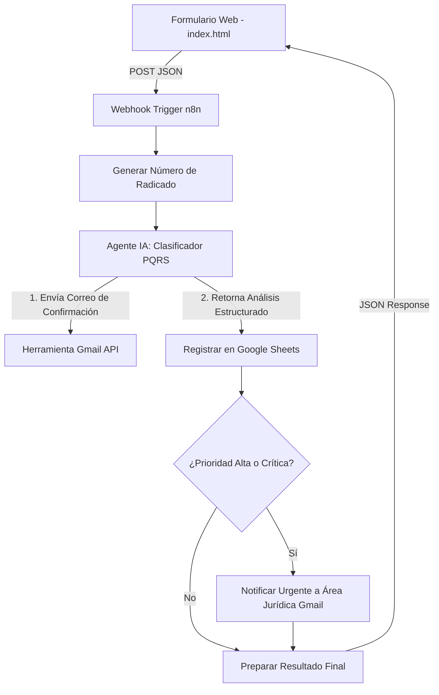

# Sistema Inteligente de Gestión de PQRSF

Este proyecto consiste en un **Sistema Inteligente de Peticiones, Quejas, Reclamos, Sugerencias y Felicitaciones (PQRSF)**, compuesto por un formulario web interactivo en el front-end y un potente flujo de automatización e inteligencia artificial en el back-end mediante **n8n**.

El sistema no solo registra las solicitudes, sino que utiliza modelos de lenguaje (LLM) para clasificarlas automáticamente por área y nivel de prioridad, detectando términos de riesgo y enviando notificaciones y correos de confirmación en tiempo real.

---

## 🛠️ Arquitectura del Sistema

El flujo completo del sistema se divide en dos componentes principales:



---

## 💻 Componentes

### 1. Front-end: Formulario de Registro (`index.html`)
Diseño de interfaz moderno y responsivo para la captura de datos de la solicitud.
- **Estética Premium (Glassmorphism)**: Interfaz fluida y limpia con soporte nativo para **Tema Claro/Oscuro**.
- **Panel de Configuración**: Permite cambiar la dirección del Webhook de n8n de forma manual.
- **Selector de Modo**:
  - **Modo Prueba (Test)**: Apunta a la URL de prueba de n8n (`/webhook-test/...`) para depuración directa desde el editor de flujos.
  - **Modo Producción (Prod)**: Apunta a la URL definitiva de n8n (`/webhook/...`).
- **Recibo Interactivo (Dynamic Receipt)**: Al enviarse con éxito, recibe la respuesta estructurada de n8n y muestra un ticket con el radicado generado, la categoría detectada por la IA, el área asignada y un mensaje de tiempo de respuesta dinámico según la prioridad.

### 2. Back-end: Flujo de Automatización (`PQRSF.json`)
Definición de flujo importable para n8n que automatiza el procesamiento lógico de la solicitud.
- **Generación de Radicado**: Código JavaScript en n8n que calcula de manera única un código en formato `PQRS-YYYYMMDD-timestamp-random` y la fecha de recepción.
- **Clasificador IA (LangChain Agent + OpenAI GPT-4o-mini)**: 
  - Clasifica el tipo de solicitud (Petición, Queja, Reclamo, Sugerencia).
  - Identifica el área responsable (**Servicio al Cliente, Servicios Financieros, Operaciones, Jurídica o Innovación**).
  - Asigna prioridad (**Alta, Media o Baja**).
  - **Detección de Palabras Clave Críticas**: Si detecta términos sensibles como *fraude, estafa, robo, demanda, lavado de activos*, fuerza automáticamente la prioridad a **Alta** y asigna el área **Jurídica**.
  - Genera un resumen del caso de máximo 100 palabras.
- **Notificación por Gmail al Solicitante**: Envía un correo con diseño HTML responsivo confirmando la recepción y detallando el radicado, área asignada y plazo estimado de respuesta.
- **Base de Datos (Google Sheets)**: Registra en orden cronológico todos los metadatos de la solicitud procesada.
- **Notificación de Alerta Urgente**: Si el caso es clasificado con **Prioridad Alta**, envía una notificación por correo inmediata al área jurídica correspondiente con un resumen estructurado del caso.

---

## 🚀 Tecnologías Utilizadas

- **Front-end**: HTML5, CSS3 (Variables de diseño y transiciones CSS) y JavaScript Vanilla.
- **Orquestador**: [n8n](https://n8n.io/) (Flujos de trabajo basados en nodos).
- **Inteligencia Artificial**: [LangChain](https://js.langchain.com/) + OpenAI API (Modelo `gpt-4o-mini`).
- **Integraciones**:
  - Google Sheets API (Persistencia de datos).
  - Gmail API (Notificaciones y confirmaciones).

---

## ⚙️ Instrucciones de Configuración y Despliegue

### Requisitos Previos
- Tener instalado **Node.js** (versión 18 o superior).
- Cuenta activa en **n8n** (Cloud o Auto-hospedado).
- API Key de **OpenAI**.
- Credenciales OAuth2 para **Google Sheets** y **Gmail** (configuradas dentro de n8n).

### Paso 1: Configurar el Backend (n8n)
1. Abre tu instancia de n8n.
2. Crea un nuevo flujo de trabajo e importa el archivo [PQRSF.json](file:///c:/Users/chami/Desktop/ProyectoSistemasInteligentes/PQRSF.json) (puedes arrastrar el archivo o usar la opción *Import from File*).
3. Configura tus credenciales correspondientes en los nodos:
   - **OpenAI Chat Model** (API Key).
   - **Gmail Tool** y **Notificar Área Jurídica** (OAuth2 de Gmail).
   - **Registrar en Sheets** (OAuth2 de Google Sheets y vincula tu propia hoja de cálculo).
4. Copia el **Webhook URL** proporcionado por el nodo *Formulario PQRS*.
5. Activa el flujo de trabajo en n8n.

### Paso 2: Ejecutar el Front-end
1. Abre una consola/terminal en la carpeta raíz del proyecto.
2. Ejecuta un servidor local rápido. Por ejemplo:
   ```bash
   npx http-server -p 8080
   ```
3. Abre tu navegador e ingresa a [http://localhost:8080](http://localhost:8080).
4. Haz clic en el ícono de engranaje (Configuración) en la parte superior derecha:
   - Configura la URL del Webhook que copiaste en el paso anterior.
   - Alterna entre modo **Prueba** o **Producción** según el estado de tu flujo en n8n.

---

## 📁 Estructura de Archivos

- [index.html](file:///c:/Users/chami/Desktop/ProyectoSistemasInteligentes/index.html): Código principal del front-end con el formulario, lógica de envío e interfaz responsive.
- [PQRSF.json](file:///c:/Users/chami/Desktop/ProyectoSistemasInteligentes/PQRSF.json): Archivo exportado del flujo de n8n para importar.
- [README.md](file:///c:/Users/chami/Desktop/ProyectoSistemasInteligentes/README.md): Documento de presentación y guía del sistema.


## Uso de IA Generativa

El desarrollo fue asistido mediante herramientas de IA generativa
(ChatGPT y Claude) para:

- Diseño de prompts.
- Documentación técnica.
- Estructuración de la arquitectura.
- Apoyo en generación de código.

Todo el código fue revisado, adaptado y comprendido por los integrantes.